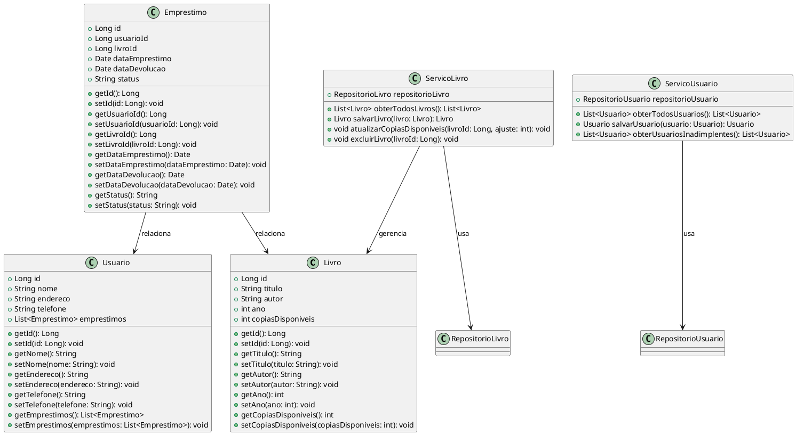

# Gerenciador de Biblioteca

Este é um projeto de uma aplicação de gerenciamento de biblioteca construída utilizando Spring Boot, Jakarta e PostgreSQL. O sistema possui funcionalidades para cadastro de livros, usuários e empréstimos, além de gerenciar as cópias de livros e identificar usuários inadimplentes.

## Funcionalidades

- Cadastro de **livros** com informações sobre título, autor, ano e número de cópias disponíveis.
- Cadastro de **usuários** com informações como nome, endereço e telefone.
- Gerenciamento de **empréstimos** de livros, com controle de status (ativo, atrasado, devolvido).
- Identificação de **usuários inadimplentes** que estão com livros atrasados.
- Notificação de livros **atrasados** para os usuários inadimplentes.

## Diagrama de Classes

O diagrama de classes abaixo ilustra a estrutura do sistema e os relacionamentos entre as principais entidades:



## Executando o Projeto

1. Clone este repositório.
2. Configure o banco de dados PostgreSQL.
3. Execute o projeto usando o comando:

   ```
   ./mvnw spring-boot:run
   ```

## Testes

Os testes automatizados estão localizados no diretório `src/test/java/com/librarymanager/service`. Para executar os testes, utilize o comando:

```
./mvnw test
```
